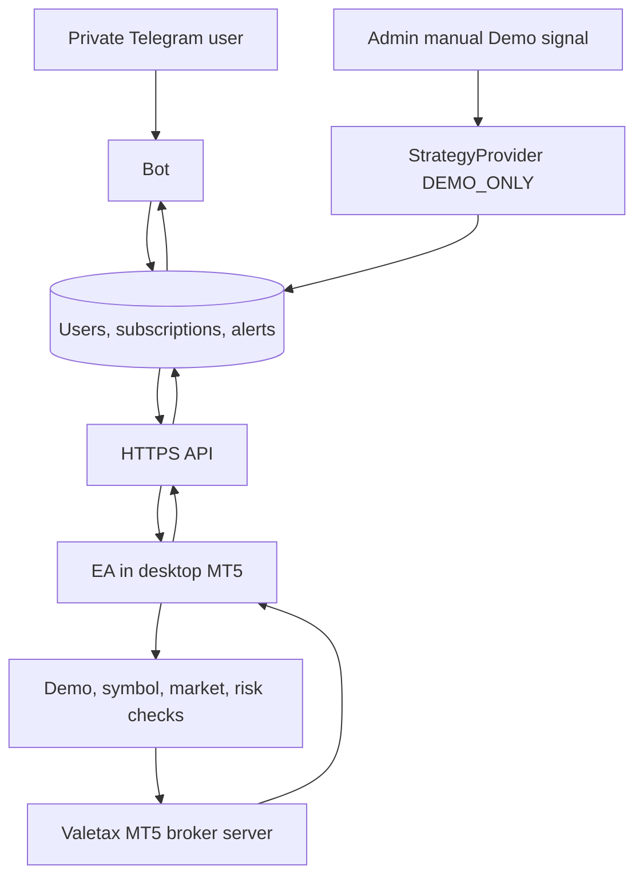
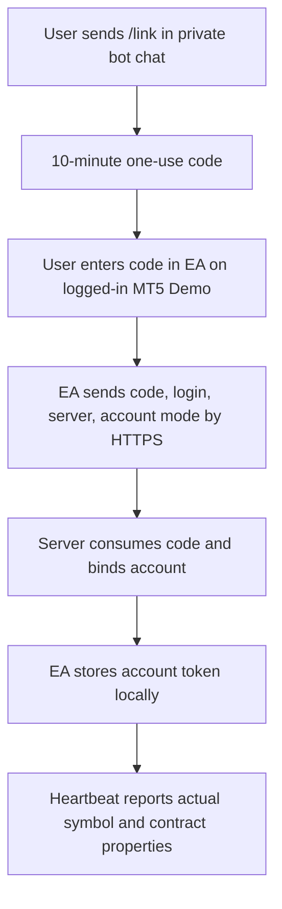

# Valetax MT5 demo coordinator

Multi-user **Demo-only** foundation with a Telegram bot, dashboard, API, and MT5 Expert Advisor. The final strategy and payments are absent. The platform never receives broker passwords or deposits. This prototype is not a production trading service. The EA rejects real accounts in code at startup and on every timer cycle; broker-side account attestation and broker order integration tests remain necessary.

## Architecture

## Windows quick start

1. Install Python 3.11+ and Git. Run `git clone https://github.com/marcel513/valetax-trading-platform.git` and `cd valetax-trading-platform`.
2. Run `py -m venv .venv`, then `.\.venv\Scripts\Activate.ps1` and `python -m pip install -r requirements.txt`.
3. Copy `.env.example` to `.env`. Set `DATABASE_PATH`, an HTTPS `BASE_URL`, and your numeric ID in `ADMIN_TELEGRAM_IDS` if you administer the system. Never commit `.env`.
4. Create a bot with Telegram BotFather. Put its token into your local `.env` as `TELEGRAM_BOT_TOKEN`; never send it to a public chat or repository.
5. In one terminal run `python -m uvicorn platform_app.api:app --host 127.0.0.1 --port 8000`; in another run `python -m platform_app.bot`. The API creates the database schema at startup.
6. On desktop MT5, log in to a Valetax **Demo** account and compile `ea/ValetaxDemoEA.mq5` in MetaEditor. In MT5 **Tools → Options → Expert Advisors**, check **Allow WebRequest for listed URL**, add the exact HTTPS base URL as a visible row in the list, and save. In the bot's **private** chat, send `/start`, then `/link`; the code expires in ten minutes. Attach the EA to a chart and set `ServerBaseUrl` plus `OneTimeLinkCode`. Keep `LocalPause=true`. After successful linking, remove the one-time code from EA inputs; the EA stores its account token locally.
7. The EA starts with `LocalPause=true` and the server account also starts paused. Use `/dashboard` to set lot and risk limits, then explicitly unpause both for a Demo test. Admins can create a two-minute Demo signal at `/admin`. Use `/stop` or `LocalPause=true` to halt new entries.

Local `http://127.0.0.1:8000` is for API tests only; the EA requires HTTPS with a valid certificate. Run MT5 desktop on a Windows PC or suitable VPS, not MT5 Web or mobile. The terminal must remain open and logged in.

## Bot and risk

Commands: `/start`, `/register`, `/subscribe`, `/link`, `/accounts`, `/ea`, `/settings`, `/trades`, `/today`, `/subscription`, `/stop`, `/dashboard`, `/help`. Results are sent only to a user's private chat. Repeated `/start` is idempotent. Failed bot sends leave alerts queued and do not change trade records. Dashboard login links are single use and expire after five minutes.

The server returns no signals if settings are off or subscription is expired/suspended. The EA checks Demo mode, broker connection, trade permission, market status, quote and spread, actual gold symbol and contract size, tick size/value, lot min/step/max, margin, stop distance, open-position count, daily loss, expiry, and mandatory stop loss. It records signal UUIDs in MT5 terminal globals before sending, favouring at-most-once attempts after restarts. Database uniqueness adds another guard. Network failure stops new entries; open positions retain their broker stop loss. Broker rejection and partial fills require manual reconciliation. The server trusts EA execution reports within each account token; it cannot independently verify a broker fill.

The `StrategyProvider` extension point is public; keep future proprietary SES logic in a private service or package. The present provider only accepts manually entered `DEMO_ONLY` XAU signals. Gold symbol suffixes and Cent/Standard/ECN contract differences are read from MT5 rather than hard coded. Payments are not configured: subscription state can be managed manually by an admin, but `/subscribe` does not charge or sell anything.

Run `python -m pytest -q`. See [operations and limitations](docs/OPERATIONS.md) for VPS, backup, recovery, two-device Git use, the validated Demo connection, and remaining broker order tests.
